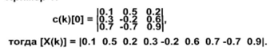

Требования к модели линейной рециркуляционной сети.

Для лабораторной работы в качестве данных входного растрового изображения использовать файлы формата BMP.

Можно использовать как цветное, так и черно-белое изображение, где значения интенсивности цвета пикселя задаются R, G, B на множестве шкал S (например S = {R, G, B}).

Исходное изображение h x w (рекомендуемый размер — не менее 256 x 256 (или картинка с таким же числом пикселей)) разбивается на Q прямоугольников размерностью `r x m (r * m =  n/|S|) (4 <= r <= h, 4 <= m <= w)`, где r и m может указать пользователь.

Все прямоугольники должны полностью покрывать исходное изображение и не выходить за его границы, может допускаться перекрытие прямоугольников.

Пусть `C(k)[q][i][j]` обозначает одно из значений R, G, B (0 <= q <= |S|) и принимает значения в диапазоне `0 <= C(k)[q][i][j] <= 255 = Cmax` (i, j — координаты пикселя).

Для того, чтобы использовать значения цвета пикселя исходного изображения для дальнейшей обработки, следует выполнить преобразование:

`c(k)[q][i][j] = (2*C(k)[q][i][j] / Cmax) - 1`,

где `c(k)[q][i][j]` — это значение цвета пикселя для дальнейших преобразований.

Так преобразуются все значения пикселей для всех прямоугольников.

Значения цвета пикселей из прямоугольников к к собираются в свой (эталонный) вектор `[X(k)]`, компоненты которого вычисляются в соответствии с выражением `X(k)[0][q + |S| *( j +i*m)] = c(k)[q][i][j]`, где целые неотрицательные числа 0 <= i < r, 0 <= j < m. То есть число элементов `[X(k)]` будет равно n, где `[X(k)]` — это матрица размера 1хn, а её значения после преобразования уже будут `|X(k)[q][0]| <= 1`.

Пример 1:

Тогда `[X(k)] = [0.1 0.5 0.2 0.3 -0.2 0.7 -0.7 0.9]`.

Задача сжатия изображения сводится к обучению линейной рециркуляционной сети на выборке из Q векторов [X(k)] с последующим их прямым распространением через обученную линейную рециркуляционную сеть с помощью матрицы весовых коэффициентов для прямого распространения [Wf].

После этого значения, полученные в первом слое, могут быть сохранены вместе с матрицей весовых коэффициентов для обратного распространения [Wb] и её размерностью.

Задача восстановления сводится к обратному распространению через линейную рециркуляционную сеть сохранённых в виде Q векторов значений второго слоя с помощью матрицы весовых коэффициентов для обратного распространения [Wb].

Восстановленные данные в виде вектора [XX[k]] могут быть использованы для воспроизведения изображения с помощью преобразования
`C(k)[q][i][j] ~= Cmax*(min(1,max(-1,XX(k)[0][q + |S| *( j +i*m)])) + 1) / 2,(2)`
Эта формула используется для воспроизведения изображения с помощью преобразования для весовых коэффициентов обратного распространения.

Коэффициент сжатия может быть рассчитан как отношение размера исходных данных к размеру данных, полученных в результате сжатия.
Если размерность исходных данных, значения которых совпадают, то коэффициент сжатия может быть рассчитан по формуле:

ВАРИАНТ 
линейная рециркулярная сеть с постоянным коэффициентом обучения и нормированными весами